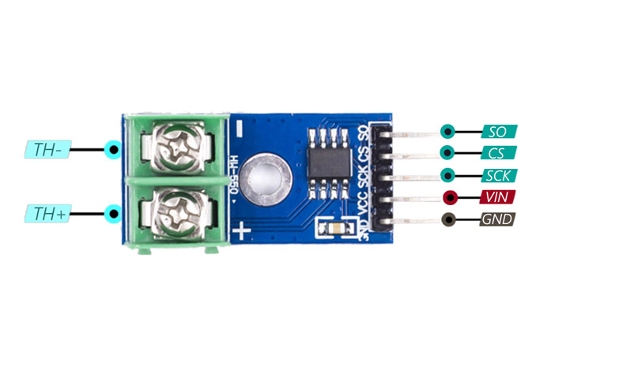
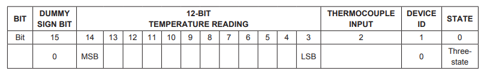

# MAX6675

This repository contains the solution for cold junction compensated K-Thermocouple to digital converter MAX6675

## Connection

|Group       |Name|Description                       |
|------------|----|----------------------------------|
|Thermocouple|TH- |Alumel lead                       |
|Thermocouple|TH+ |Chromel lead                      |
|SPI         |SO  |MISO (Master Input - Slave Output)|
|SPI         |CS  |Chip select                       |
|SPI         |SCK |Serial clock                      |
|Power       |Vin |3 - 5.5 V                         |
|Power       |GND |Ground                            |

## Data packet structure

## Sequencing

+ Press the CS to the ground
+ Read 2 bytes by SPI
+ Press the CS to the power
+ Bitwise shift right by **5** bits (**3** bits shift for 0-2 bits remove, and **2** bits shift to convert to Celsius)
+ Waits for chip ready (according to Datasheet, the max time for conversion is 220ms)
+ Repeat